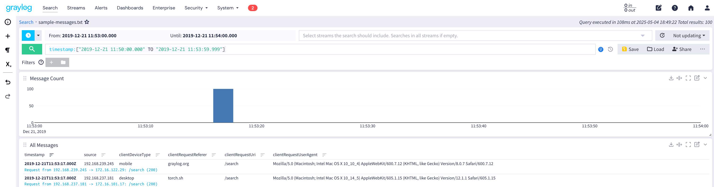

# Log2Graylog

[](https://www.oracle.com/java/technologies/javase/jdk17-archive-downloads.html)
[](https://opensource.org/licenses/MIT)

A command-line tool that parses log messages from files and forwards them to a Graylog server using the GELF HTTP input protocol.

## Table of Contents

- [Overview](#overview)
- [Features](#features)
- [Installation](#installation)
  - [Prerequisites](#prerequisites)
  - [Building from Source](#building-from-source)
- [Usage](#usage)
  - [Command Line Options](#command-line-options)
  - [Examples](#examples)
- [Architecture](#architecture)
- [Development](#development)
  - [Project Structure](#project-structure)
  - [Testing](#testing)
- [Roadmap](#roadmap)
- [Author](#author)
- [License](#license)

## Overview

Log2Graylog is a utility for parsing log files and sending their contents to a Graylog server in GELF format. 



## Features
- 
- Command-line tool with options for specifying the Graylog server URL
- Parse log messages from files with specific formats (e.g., JSON)
- Extract and map fields from log messages to GELF format
- Add additional metadata to log entries
- Send GELF messages to a Graylog server over HTTP

## Installation

### Prerequisites

- Java 17 or higher
- Maven 3.6 or higher
- A running Graylog server with a GELF HTTP input configured

### Building from Source

1. Clone the repository:
   ```bash
   git clone https://github.com/yourusername/log2graylog.git
   cd log2graylog
   ```

2. Build the application using Maven:
   ```bash
   mvn clean package
   ```

This will create an executable JAR file in the `target` directory.

## Usage

### Command Line Options

```
Usage: Log2Graylog [-hVv] [-o=<graylogUrl>] LOG_FILE
Parses log messages and sends them to Graylog using the GELF format.
      LOG_FILE                 The log file to parse
  -h, --help                   Show this help message and exit.
  -o, --out=<graylogUrl>       The output URL of the Graylog GELF HTTP interface
                               Default: http://localhost:12202/gelf
  -v, --verbose                Enable verbose output
  -V, --version                Print version information and exit.
```

### Examples

Basic usage with default Graylog URL (http://localhost:12202/gelf):
```bash
java -jar target/log2graylog-1.0-SNAPSHOT.jar sample-messages.txt
```

Specify a custom Graylog URL:
```bash
java -jar target/log2graylog-1.0-SNAPSHOT.jar sample-messages.txt --out http://graylog-server:12202/gelf
```

Enable verbose output:
```bash
java -jar target/log2graylog-1.0-SNAPSHOT.jar sample-messages.txt -v
```

## Architecture

Log2Graylog uses a modular architecture with the following components:

1. **CLI Interface** - Handles command-line arguments and user interaction
2. **Log Parser** - Reads and parses log files into structured data
3. **GELF Formatter** - Converts parsed log entries to GELF format
4. **HTTP Sender** - Sends GELF messages to the Graylog server

The application uses dependency injection (Guice) to manage component dependencies and configuration.

## Development

### Project Structure

```
src/main/java/org/rolandort/
├── Main.java                  # Application entry point
├── cli/                       # Command-line interface
├── di/                        # Dependency injection
├── formatter/                 # GELF message formatting
├── model/                     # Data models
├── parser/                    # Log file parsing
├── sender/                    # HTTP communication
└── service/                   # Business logic
```

### Testing

To run the tests:
```bash
mvn test
```

## Roadmap

Planned improvements:

- **Performance Enhancements**:
  - Support for large log files (10+ GB) through chunking and parallel processing
  - Asynchronous HTTP requests using CompletableFuture or PushPromiseHandler

- **Feature Additions**:
  - Configurable HTTP timeouts (currently fixed at 10 seconds)
  - Support for additional log formats
  - Direct integration with Log4J2 GELF appender

- **Technical Debt**:
  - Fix timestamp handling for historical log entries
  - Improve naming conventions for formatters based on log sources
  - Enhance error handling and reporting

## Author

This project was created by [Roland Ortner](https://www.linkedin.com/in/rolandortner/).

## License

This project is licensed under the MIT License - see the LICENSE file for details.
